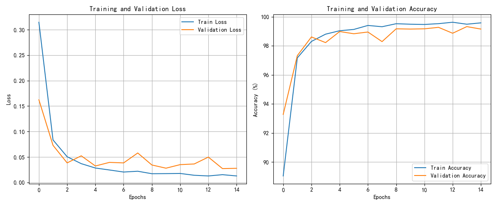
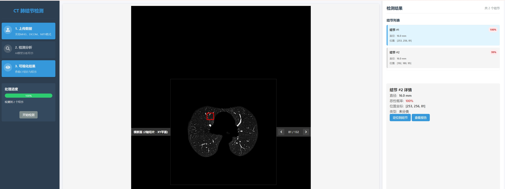

# 3D肺结节检测系统

## 0. 项目结构

```
├── data/               # 数据处理相关
│   ├── dataclass/      # 数据类定义，包含NoduleCube结节立方体类
│   └── preprocessing/  # 数据预处理代码，包括LUNA16数据处理
├── models/             # 模型定义
│   └── pytorch_c3d_tiny.py  # Tiny-C3D模型定义
├── training/           # 模型训练相关
│   ├── pytorch_logs/   # 训练日志
│   ├── pytorch_checkpoints/ # 模型检查点
│   └── train_c3d_pytorch.py # 训练脚本
├── inference/          # 模型推理相关
│   ├── classifier.py   # 分类器实现
│   ├── detector.py     # 检测器实现
│   └── pytorch_nodule_detector.py # PyTorch实现的结节检测器
├── deploy/             # 部署相关
│   ├── backend/        # 后端代码
│   ├── frontend/       # 前端代码
│   └── run.py          # 启动脚本
└── util/               # 工具函数
```

## 1. Tiny-C3D模型架构设计

Tiny-C3D是一个轻量级的3D卷积神经网络，专为肺结节分类设计。模型采用了C3D架构的简化版本，保留核心功能的同时大幅减少参数量，使其适合在资源受限环境中运行。
原始的C3D模型是用于视频分类的 [Learning Spatiotemporal Features with 3D Convolutional Networks](https://arxiv.org/abs/1412.0767)

### 模型结构

模型包含4个3D卷积块，每个卷积块由以下组件构成：
- 3D卷积层
- 批归一化层
- ReLU激活函数
- 最大池化层
- Dropout层（防止过拟合）

输入数据为32×32×32的体素立方体，模型结构如下

```commandline
C3dTiny(
  (conv_block1): Sequential(
    (0): Conv3d(1, 64, kernel_size=(3, 3, 3), stride=(1, 1, 1), padding=(1, 1, 1))
    (1): BatchNorm3d(64, eps=1e-05, momentum=0.1, affine=True, track_running_stats=True)
    (2): ReLU()
    (3): MaxPool3d(kernel_size=(1, 2, 2), stride=(1, 2, 2), padding=0, dilation=1, ceil_mode=False)
  )
  (conv_block2): Sequential(
    (0): Conv3d(64, 128, kernel_size=(3, 3, 3), stride=(1, 1, 1), padding=(1, 1, 1))
    (1): BatchNorm3d(128, eps=1e-05, momentum=0.1, affine=True, track_running_stats=True)
    (2): ReLU()
    (3): MaxPool3d(kernel_size=2, stride=2, padding=0, dilation=1, ceil_mode=False)
  )
  (drop_out1): Dropout(p=0.2, inplace=False)
  (conv_block3): Sequential(
    (0): Conv3d(128, 256, kernel_size=(3, 3, 3), stride=(1, 1, 1), padding=(1, 1, 1))
    (1): BatchNorm3d(256, eps=1e-05, momentum=0.1, affine=True, track_running_stats=True)
    (2): ReLU()
    (3): Conv3d(256, 256, kernel_size=(3, 3, 3), stride=(1, 1, 1), padding=(1, 1, 1))
    (4): BatchNorm3d(256, eps=1e-05, momentum=0.1, affine=True, track_running_stats=True)
    (5): ReLU()
    (6): MaxPool3d(kernel_size=2, stride=2, padding=0, dilation=1, ceil_mode=False)
  )
  (drop_out2): Dropout(p=0.2, inplace=False)
  (conv_block4): Sequential(
    (0): Conv3d(256, 512, kernel_size=(3, 3, 3), stride=(1, 1, 1), padding=(1, 1, 1))
    (1): BatchNorm3d(512, eps=1e-05, momentum=0.1, affine=True, track_running_stats=True)
    (2): ReLU()
    (3): Conv3d(512, 512, kernel_size=(3, 3, 3), stride=(1, 1, 1), padding=(1, 1, 1))
    (4): BatchNorm3d(512, eps=1e-05, momentum=0.1, affine=True, track_running_stats=True)
    (5): ReLU()
    (6): MaxPool3d(kernel_size=2, stride=2, padding=0, dilation=1, ceil_mode=False)
  )
  (drop_out3): Dropout(p=0.2, inplace=False)
  (flatten): Flatten(start_dim=1, end_dim=-1)
  (fc1): Sequential(
    (0): Linear(in_features=8192, out_features=512, bias=True)
    (1): ReLU()
  )
  (fc2): Linear(in_features=512, out_features=2, bias=True)
)
```


## 2. 数据准备与预处理

### 2.1 数据来源

本项目使用[LUNA16（Lung Nodule Analysis 2016）](https://luna16.grand-challenge.org/)数据集，该数据集包含肺CT扫描图像和结节位置标注。

### 2.2 标注数据处理

- 恶性结节坐标标注数据使用的是 `annotations.csv`.最大结节半径为16，所以当前抽取的cube边长为32
- 良性结节坐标标注数据使用的是 `candidates_V2.csv`。注意，这部分标注数据可能是随机生成的，需要做筛选处理，当前代码中`luna16_prepare_cube_data.py`执行 `get_real_candidate`将标注数据筛选后重新保存。


### 2.3 cube预处理流程

1. **结节立方体提取**:
   - 从原始CT图像中提取以结节为中心的32×32×32立方体
   - 根据标注信息区分良性与恶性结节

2. **数据归一化**:
   - 通过`normal_cube_to_tensor`函数将数据归一化到[0,1]范围
   - 修复无效值，如NaN和Inf

3. **数据增强(只对良性结节)**:
   - 随机旋转：在三个轴向上随机旋转±20度
   - 随机翻转：沿指定轴随机翻转
   - 高斯噪声：添加低强度高斯噪声增强模型鲁棒性

4. **数据平衡**:
   - 采样相等数量的正负样本，避免类别不平衡
   - 负样本采样量为正样本的两倍，提高模型对负样本的敏感度。此问题没有完全解决，最终模型仍然存在大量误判，需要对结果根据坐标进一步筛选

### 2.4 数据类设计

#### 2.4.1 CTData

这个类主要负责 将从DICOM或MHD格式的原始CT数据，经过HU转换，缩放到统一的0-1之间的标准像素数据。

#### 2.4.2 NoduleCube

主要从直接从0-1之间的标准像素数据的多维数组中抽取 指定边长的Cube数据，保存和加载npy，保存和加载png图像数据等。

## 3. 模型训练与参数设置

### 3.1 训练参数

- **批量大小**: 64。 这个参考自己的GPU显存设置，此为 nvidia 4070 显卡参数
- **学习率**: 5e-4
- **权重衰减**: 1e-5
- **优化器**: Adam
- **损失函数**: 交叉熵损失
- **训练轮次**: 15
- **学习率调度**: ReduceLROnPlateau
- **梯度裁剪**: 1.0

### 3.2 训练流程

训练代码为 `training/train_c3d_pytorch.py`, 设置自己的数据目录

1. 加载预处理后的正负样本
2. 按8:2比例分割训练集和验证集
3. 数据增强提高模型泛化能力
4. 每轮训练后在验证集上评估
5. 保存最佳验证准确率模型

### 训练结果

训练日志如下

```commandline
2025-03-31 22:33:51,563 - c3d_training - INFO - Epoch [1/15], Train Loss: 0.3146, Train Acc: 89.05%, Val Loss: 0.1623, Val Acc: 93.28%, Time: 80.81s
2025-03-31 22:35:12,255 - c3d_training - INFO - Epoch [2/15], Train Loss: 0.0834, Train Acc: 97.17%, Val Loss: 0.0728, Val Acc: 97.33%, Time: 80.39s
2025-03-31 22:36:33,755 - c3d_training - INFO - Epoch [3/15], Train Loss: 0.0504, Train Acc: 98.30%, Val Loss: 0.0383, Val Acc: 98.61%, Time: 81.20s
2025-03-31 22:37:55,955 - c3d_training - INFO - Epoch [4/15], Train Loss: 0.0368, Train Acc: 98.80%, Val Loss: 0.0522, Val Acc: 98.22%, Time: 81.89s
2025-03-31 22:39:16,050 - c3d_training - INFO - Epoch [5/15], Train Loss: 0.0282, Train Acc: 99.04%, Val Loss: 0.0322, Val Acc: 98.98%, Time: 79.84s
2025-03-31 22:40:37,157 - c3d_training - INFO - Epoch [6/15], Train Loss: 0.0244, Train Acc: 99.13%, Val Loss: 0.0393, Val Acc: 98.83%, Time: 80.80s
2025-03-31 22:41:59,029 - c3d_training - INFO - Epoch [7/15], Train Loss: 0.0204, Train Acc: 99.40%, Val Loss: 0.0383, Val Acc: 98.95%, Time: 81.64s
2025-03-31 22:43:20,016 - c3d_training - INFO - Epoch [8/15], Train Loss: 0.0219, Train Acc: 99.31%, Val Loss: 0.0578, Val Acc: 98.29%, Time: 80.75s
2025-03-31 22:44:41,369 - c3d_training - INFO - Epoch [9/15], Train Loss: 0.0171, Train Acc: 99.52%, Val Loss: 0.0342, Val Acc: 99.17%, Time: 81.13s
2025-03-31 22:46:02,745 - c3d_training - INFO - Epoch [10/15], Train Loss: 0.0173, Train Acc: 99.49%, Val Loss: 0.0279, Val Acc: 99.15%, Time: 81.04s
2025-03-31 22:47:24,128 - c3d_training - INFO - Epoch [11/15], Train Loss: 0.0176, Train Acc: 99.47%, Val Loss: 0.0349, Val Acc: 99.17%, Time: 81.15s
2025-03-31 22:48:44,717 - c3d_training - INFO - Epoch [12/15], Train Loss: 0.0140, Train Acc: 99.53%, Val Loss: 0.0362, Val Acc: 99.27%, Time: 80.36s
2025-03-31 22:50:07,041 - c3d_training - INFO - Epoch [13/15], Train Loss: 0.0126, Train Acc: 99.62%, Val Loss: 0.0497, Val Acc: 98.87%, Time: 82.02s
2025-03-31 22:51:27,896 - c3d_training - INFO - Epoch [14/15], Train Loss: 0.0152, Train Acc: 99.49%, Val Loss: 0.0271, Val Acc: 99.32%, Time: 80.61s
2025-03-31 22:52:49,409 - c3d_training - INFO - Epoch [15/15], Train Loss: 0.0127, Train Acc: 99.58%, Val Loss: 0.0277, Val Acc: 99.15%, Time: 81.20s

```

损失函数和准确率随着epoch的示意图如下



## 4. 模型推理

推理系统设计为两阶段流程：

### 1. 结节检测

- 使用滑动窗口技术扫描完整CT体积
- 检测潜在结节位置
- 非极大值抑制合并重叠检测结果

### 2. 结节分类

- 对检测到的候选区域提取特征
- 应用训练好的Tiny-C3D模型
- 输出结节概率和恶性度评分

### 推理优化

- 批处理推理提高处理效率
- 基于阈值过滤低置信度检测
- 多线程实现并行处理

## 5. 模型部署与效果

### 5.1 部署架构

所有的部署代码在 `deploy` 目录下，可以单独抽出来部署。注意，上面训练完成的模型，需要替换到 `deploy/backend/data` 目录下，当前代码使用的是 `c3d_nodule_detect.pth`。是前面训练过程中保留的最好的模型

系统采用前后端分离架构:

- **后端**: Flask RESTful API服务
- **前端**: 基于HTML5和WebGL的交互式3D可视化界面

### 5.2 用户界面

- 支持多种CT数据格式上传。当前测试了MHD,没有测试DICOM
- 结节位置标注和概率显示
- 交互式浏览不同结节视图

### 5.3 部署效果

系统在本地环境中运行流畅，能够在数3分钟左右内完成单个CT扫描，推理一个CUBE仅需要0.2秒，主要是CUBE扫描比较耗时。结节检测和分类准确率达到临床应用参考水平，可为放射科医生提供辅助诊断支持。

